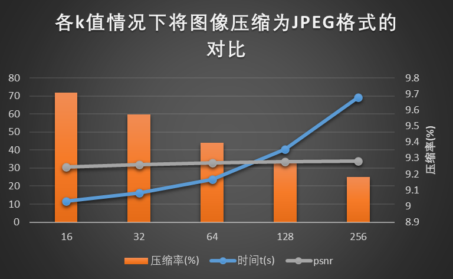
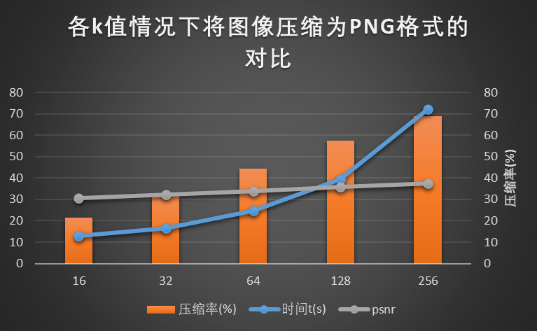

# 使用小波变换和KMeans进行图像压缩并与pillow库自带方法进行比较


本项目是最优化理论课程的期末PJ。我分别使用KMeans算法和小波变换的方法，将给定图像进行压缩。由于保存图像需要用到pillow库自带的save方法，两种方法得到的数据在保存成JPEG格式后与单纯的JPEG算法得到的图像在压缩率上减小很少甚至没有减少。为了更好地看到压缩效果，我还将压缩后的图像存为PNG格式，KMeans方法得到的结果的压缩率就很可观了。


## Requirements
整个项目使用Python 3.8构建。可使用下面的命令安装所有依赖包:
```
pip install -r requirements.txt
```

## 图像数据来源
图像数据是CVPR 2021 Challenge on Learning the Super-Resolution Space (https://github.com/andreas128/NTIRE21_Learning_SR_Space) 这个挑战赛的训练集数据里拿出前十张做成的。这些图像都较为高清，可以满足本项目的需求。图像保存在raw文件夹中。


## 运行
直接使用下面的命令就能复现所有结果。压缩好的图像都放在compressed文件夹中。先按JPEG和PNG格式分类，再按J(JPEG算法)、K(KMeans算法)、W(小波变换)分类。
```
python main.py
```

# results
各个算法在每张图像上花费的压缩时间、压缩比率及psnr保存在了j_result.xlsx、k_result.xlsx、w_result.xlsx三个Excel文件中。然后我根据这些结果手动做出了汇总.xlsx。
首先是不同k值情况下KMeans方法的压缩效果：
当压缩为JPEG格式时，按理应该随着k的增大，压缩后图像更大，压缩比率也更大才对。但结果恰恰相反。这可能是因为JPEG本身压缩程度很高，加上KMeans方法也不能达到更好的压缩效果了。

当压缩为PNG格式时，KMeans的压缩效果就很好的展现出来了，当k为16时，只需要原来的20%大小就能展示图像。

综合来看，JPEG算法真的很有效。KMeans方法的压缩率都比不上原生的JPEG的。只有小波变换的可以勉强低一些。但小波变换的psnr又降低不少。

| 方法名    | JPEG算法    | Kmeans(k取256) | 小波变换    |
|-----------|-------------|----------------|-------------|
| 时间t(s)  | 0.114743519 | 69.34435227    | 0.551638007 |
| 压缩率(%) | 8.973726381 | 9.183567889    | 6.874779569 |
| psnr      | 34.81412874 | 34.04128045    | 32.047056568 |

而当压缩为PNG格式时，KMeans虽然比较耗时，但实实在在压缩了不少。

| 方法名    | JPEG算法    | Kmeans(k取16) | 小波变换    |
|-----------|-------------|---------------|-------------|
| 时间t(s)  | 1.175263119 | 13.04571245   | 2.188440084 |
| 压缩率(%) | 93.04344426 | 21.34667795   | 70.018121910 |
| psnr      | 100         | 30.68465761   | 32.866157344|